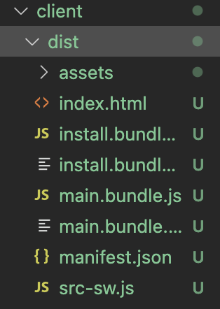

# scribbles-of-the-frantics

## [Description](#table-of-content)
Scribbles of the Frantic is a text editor that runs in the browser.
## Table of content
* [Desription](#description)
* [Installation](#installation)
* [Usage](#usage)
* [License](#license)
* [Credits](#credits)

## [Installation](#table-of-content)
This project is build from the [starter code](https://github.com/coding-boot-camp/cautious-meme). It is deployed on Heroku. [Click here](https://scribbles-of-the-frantics.herokuapp.com/).

Packages to install
* [express](https://www.npmjs.com/package/express)
```bash
npm i express
```

* [webpack.js](https://webpack.js.org/guides/getting-started/)
```bash
npm i --save-dev webpack
npm i webpack webpack-cli --save-dev
npm i webpack-dev-server --save-dev
```

* [Babel](https://www.npmjs.com/package/Babel)
```bash
npm i babel
```
* [IndexedDB](https://www.npmjs.com/package/idb)
```bash
npm i idb
```
To run the server, use this command
```bash
npm run start
```
You will see a new file create inside client folder called "dist".



Switch to incognito window, click on the browser and type in: http://localhost:3000/


## [Usage](#table-of-content)
[Click here to use the application](https://scribbles-of-the-frantics.herokuapp.com/)

This is what you will see on the first page.

You can write any thing here


If you refresh, your input will save.

## [License](#table-of-content)
MIT

## [Credits](#table-of-content)
Without these guidances and references, my project would not exist.
* 19-PWA/01-Activities/03-Day/23-Ins_IndexedDB-CRUD
* 19-PWA/01-Activities/03-Day/25-Ins_Manifest
* 19-PWA/01-Activities/03-Day/28-Stu_Mini-Project

* [Caching](https://web.dev/learn/pwa/caching/)

* [Workbox](https://web.dev/learn/pwa/workbox/)
* [Workbox Offline fall back](https://web.dev/learn/pwa/workbox/#offline-fallback)
* [workbox-recipes and CacheFirst](https://developer.chrome.com/docs/workbox/modules/workbox-recipes/)
* [Static resources cache](https://developer.chrome.com/docs/workbox/modules/workbox-recipes/#static-resources-cache)

[Back to the top](#scribbles-of-the-frantics)